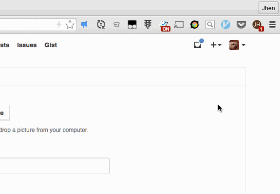
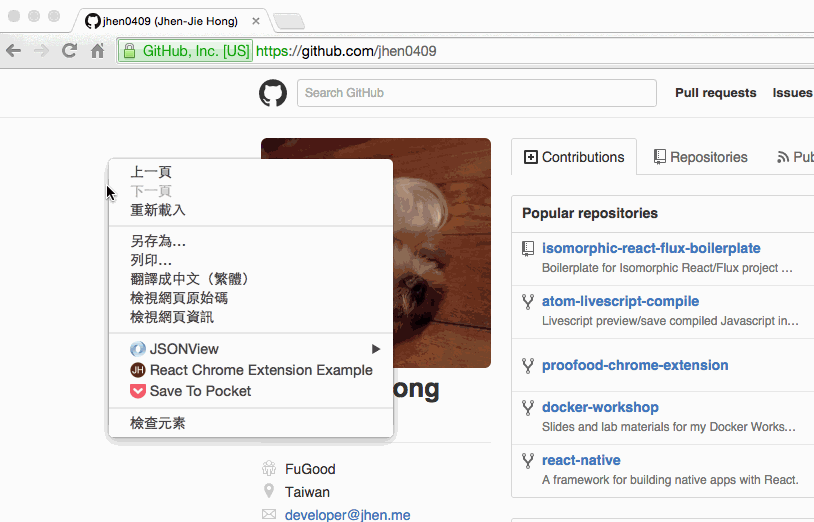

# Shiphawk HawkVision by Emilia, Sol, Alex, Mark


ShipHawk HawkVision 

## Included

 - [babel](https://github.com/babel/babel)
 - [react](https://github.com/facebook/react)
 - [redux](https://github.com/rackt/redux)
 - [react-redux](https://github.com/gaearon/react-redux)
 - [redux-devtools](https://github.com/gaearon/redux-devtools)
 - [redbox-react](https://github.com/KeywordBrain/redbox-react)
 - [webpack](https://github.com/webpack/webpack)
 - [react-transform-hmr](https://github.com/gaearon/react-transform-hmr)
 - [react-transform-catch-errors](https://github.com/gaearon/react-transform-catch-errors)
 - [babel-plugin-react-transform](https://github.com/gaearon/babel-plugin-react-transform)
 - [gulp-](https://github.com/gulpjs/gulp)
   - [jade](https://github.com/phated/gulp-jade)
   - ...
 - [classnames](https://github.com/JedWatson/classnames)
 - [todomvc-app-css](https://github.com/tastejs/todomvc-app-css)
 - ...

#### Popup



The `todos` state will be saved to `chrome.storage.local`.

#### Window



The context menu is created by `chrome/app/background/contextMenus.js`.

If you want Packaged app, You can edit `manifest.{env}.json`.
```json
...
  "app": {
    "launch": {
      "local_path": "app.html",
      "container": "panel",
      "width": 800,
      "height": 500
    }
  },
...
```

and remove `browser_action`.

#### Inject page

The inject script is being run by `chrome/app/background/inject.js`. A simple example will be inject bottom of page(`https://github.com/*`) if you visit.

## Installation

```bash
# required node.js/io.js
# clone it
npm install

# or npm way
npm install react-chrome-extension-boilerplate --dev
```

## Development

* Run script
```bash
# build files to './dev'
# start WebpackDevServer
npm run dev
```
* Allow `https://localhost:3000` connections (Because `injectpage` injected Github(https) pages, so `webpack-dev-server` procotol must be https.)
* Load unpacked extensions with `./dev`

#### React/Flux hot reload

This chrome extension uses `Webpack` and `react-transform`, and use `Redux`. You can hot reload by editing related files of Popup & Window.

## Build

```bash
# build files to './build'
npm run build
```

## Build & Compress ZIP file

```bash
# compress build folder to archive.zip
npm run compress
```

## Test

* `test/app`: React components, Redux actions & reducers tests
* `test/e2e`: E2E tests (use [chromedriver](https://www.npmjs.com/package/chromedriver), [selenium-webdriver](https://www.npmjs.com/package/selenium-webdriver))

```bash
npm run test-crdv  // start chromedriver
npm test
```

## LICENSE

[MIT](LICENSE)